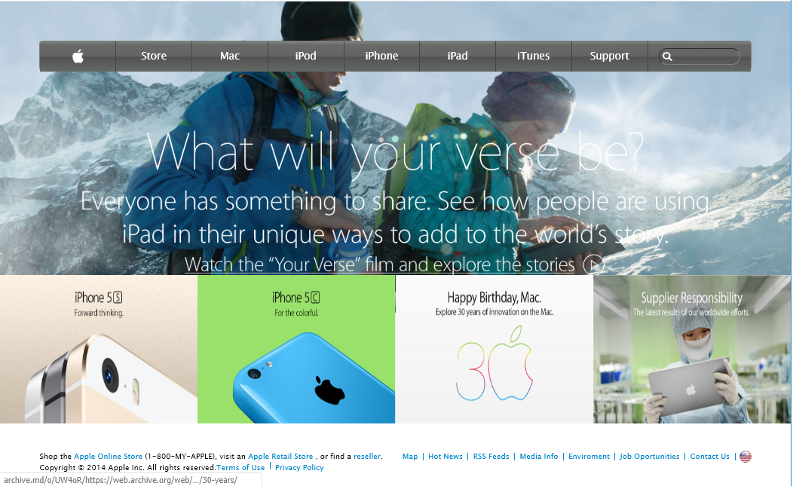

# Building-with-Backgrounds-and-Gradients
> Clone of an old version of the Apple website webpage

Remake of an old Apple home page - [Apple.com](https://archive.md/UW4oR).

## Built With

- Html,
- CSS

## Live Demo

[Live Demo Link](https://rawcdn.githack.com/vzdrizhni/Building-with-Backgrounds-and-Gradients/4aab7645a2f4ffaba38f6f8f4a5714adca385896/index.html)

## Authors

👤 **Author1**

- Github: [@vzdrizhni](https://github.com/vzdrizhni)
- Linkedin: [Roman Nikolaev](https://www.linkedin.com/feed/)

## 🤝 Contributing

Contributions, issues and feature requests are welcome! Start by:
* Forking the project
* Cloning the project to your local machine
* `cd` into the project directory
* Run `git checkout -b your-branch-name`
* Make your contributions
* Push your branch up to your forked repository
* Open a Pull Request with a detailed description to the development branch of the original project for a review

## 📝 License

This project is [MIT](https://opensource.org/licenses/MIT) licensed.
